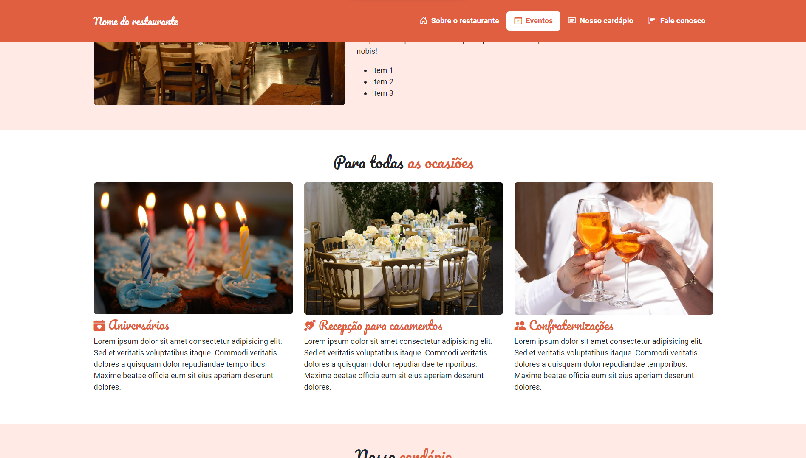

# Restaurant website - bootstrap


This application showcases the utilization of Bootstrap to construct a website, incorporating functionalities such as an image carousel, scroll spy, tab menu, and icons.

## Index
- <a href="#functionalities">Application functionalities</a>
- <a href="#layout">Layout</a>
- <a href="#demonstration">Demonstration</a>
- <a href="#run">How to run the application</a>
- <a href="#tecnologies-used">Tecnologies used</a>
- <a href="#developer">Developer</a>

## Application functionalities
 - [x]  Hamburguer menu
 - [x]  Image carousel 
 - [x]  Tab menu 
 - [x]  Scroll spy
## Layout




## Demonstration
[Link (deploy)]()


## How to run the application
```bash
# Clone this repository
$ git clone repolink

# Acess the app folder on your terminal
$ cd restaurant-bootstrap


# Utilize a local server launch tool to view the application in your browser

```

## Tecnologies used
1. HTML
2. CSS
3. Bootstrap

## Developer
[LinkedIn](https://www.linkedin.com/in/julia-silva-borges/)
